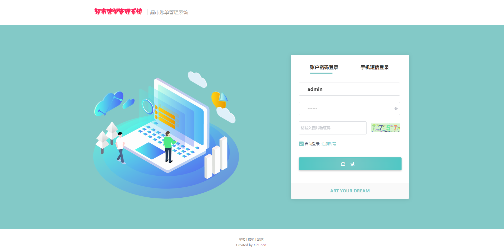
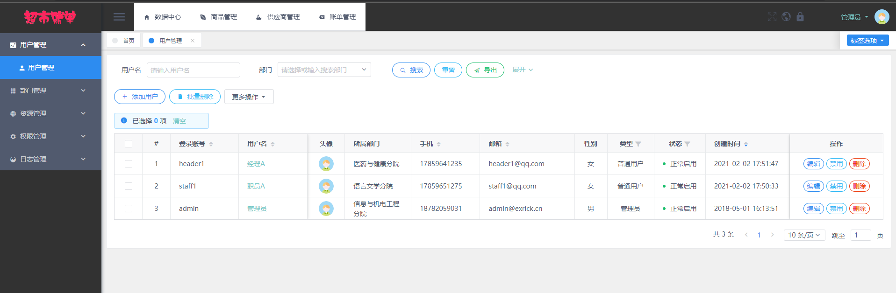
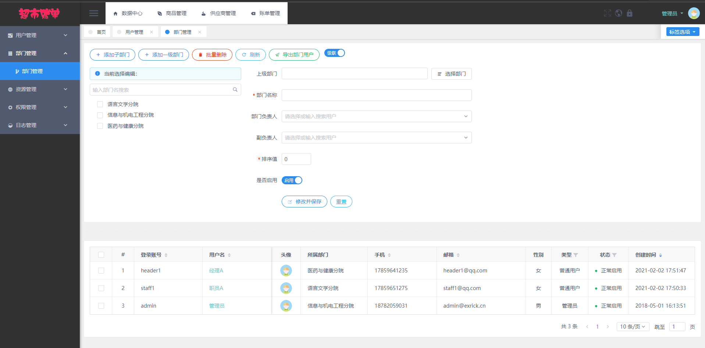
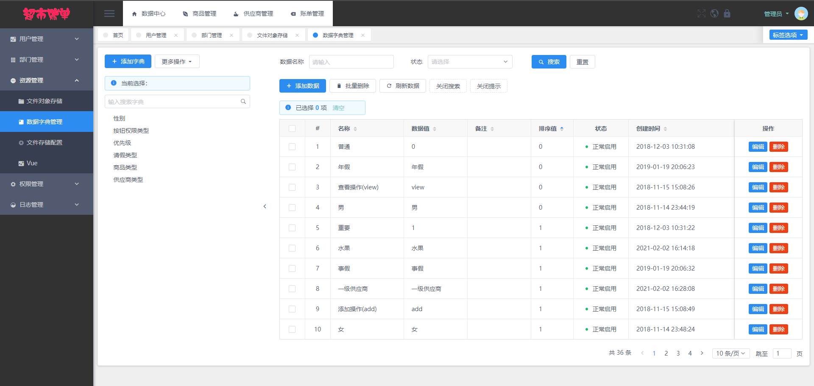
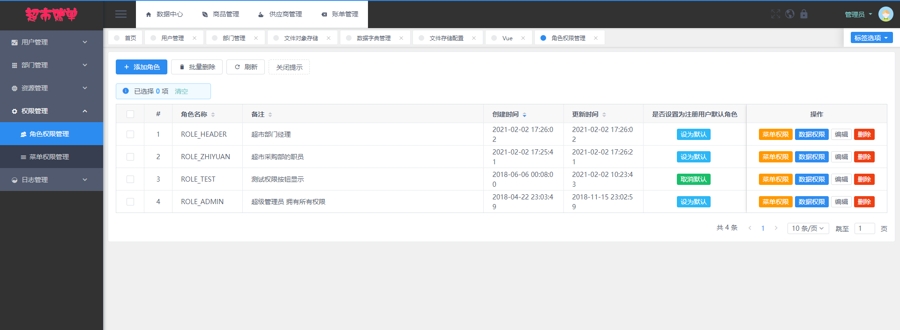
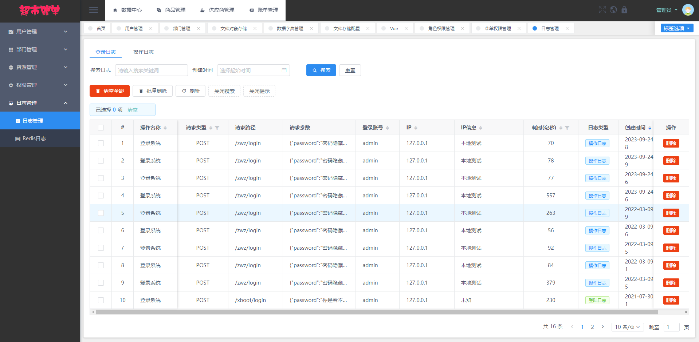
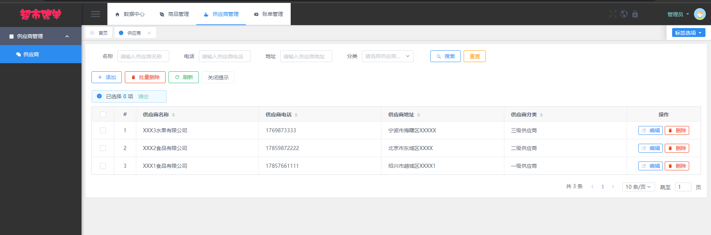
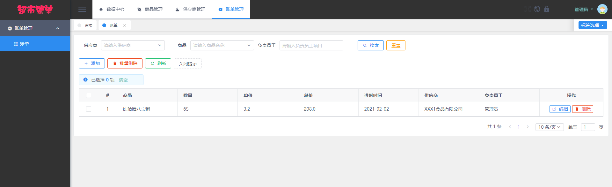

**完整代码收费 +   316595344     或    lz316595344  咨询** 

**接毕业设计和论文**

**如果图片加载不出来可以去博客看 https://blog.csdn.net/qq_56450993/article/details/133237049**

**毕业设计所有选题地址**

**[github]👉https://github.com/XinChennn/allProjects**

**[忻辰的个人博客]👉https://www.ixinjiu.cn/articles/156**

# SpringBoot+Vue 超市管理系统

## 一、软件简介

本软件是《基于Vue和SpringBoot的超市账单管理系统》，支持**商品模块、供应商模块、账单模块**这三大核心业务，适用于小型超市管理商品账单，支持的功能如下。

- 系统基础管理：对登入用户、部门、角色、权限进行维护。
- 商品管理：对超市所出售的商品档案进行维护。
- 供应商管理：对超市所合作的供应商档案进行维护。
- 账单管理：对超市所管理的账单档案进行维护。  

系统前端采用 View UI 组件库，后端集成MyBatisPlus连接MySQL数据库，采用Spring Security做权限控制。

超市账单管理系统采用了**基于角色的访问控制**，角色和菜单关联，一个角色可以配置多个菜单权限；然后再将用户和角色关联，一位用户可以赋予多个角色。这样用户就可以根据角色拿到该有的菜单权限，更方便小型超市的管理人员进行权限管控。

## 二、技术选型

### 前端

Vue-2.6.14，View UI-4.7.0

### 后端

Spring Boot-2.7.0，MyBatis / MyBatis Plus-3.5.2

### 数据库

MySQL-8.0.29，Redis-5.0.14

### 开发环境

VsCode，IntelliJ IDEA，JDK17，Maven，NodeJs-16.13.0

## 三、界面预览  

## 四、浏览地址

  - 前台地址  http://localhost:8080/#/login  账号： admin 密码： 123456

## 五、安装教程

1. 使用Navicat或者其它工具，在mysql中创建对应名称的数据库，然后运行项目的`db`目录下的sql脚本（询问作者索取）；

2. 使用IDEA/Eclipse导入项目，若为maven项目请选择maven;导入成功后请执行maven clean;maven install命令，然后运行；

3. 进入 `~\back\src\main\resources` 修改 `application.yml` 里面的数据库配置，`spring.datasource.password` 改为本机mysql密码；

4. 启动项目后端项目

5. 使用黑窗口（cmd）进入 `~\front` 目录，执行 `npm install`，成功之后执行 `npm run dev` 启动前端项目

**需要完整代码 +   316595344     或    lz316595344  咨询** 
